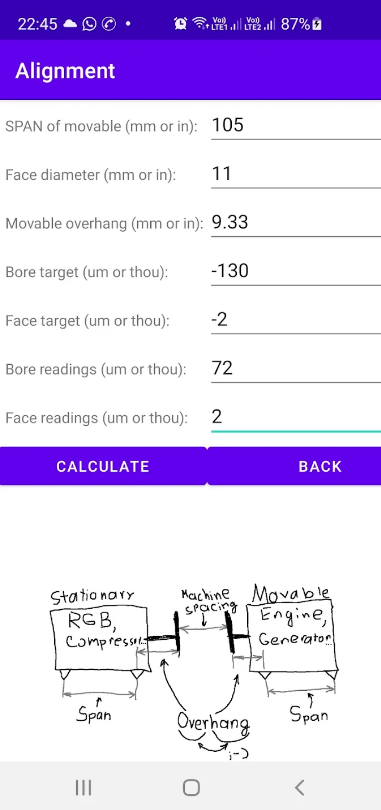
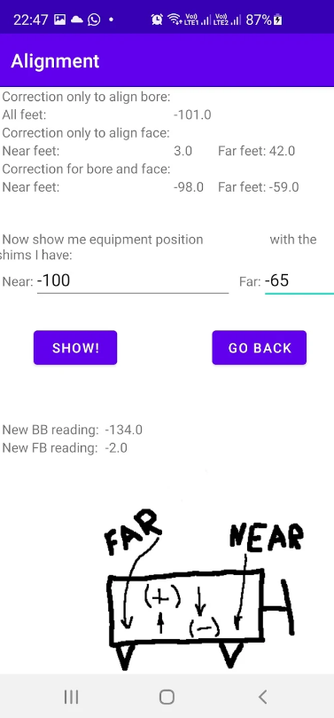

# Alignment

[Objective](#objective)

[Overview](#overview)

## Objective

Performing shaft alignment is a routine task during commissioning, major components exchange and sometimes as a part of maintenance activities. After measuring of actual shafts position, technitian has to calculate how much movable machine has to be moved in vertical and lateral planes in order to position the shafts according to target values. Due to the fact that movable machine is normally moved using pads that are located at some (considerable) offset from shaft faces, conversion is needed from machine pad movement to shaft face movement.

Normally, a desktop application is used to calculate required adjustment, however in many cases it is desirable to perform quick calculation in situ. A mobile app is ideal for such purposes.

There was another reason behind developing this app. The desktop app used in my company does not allow prediction of shaft position with given machine pad movement. This is a nice and handy feature when, for example, available shims do not completely match proposed adjustment. This feature is added to Alignment app.

There are multiple apps available for this purpose. Other apps can boast extensive funcionality, fancy design and some are developed to be used with proprietary lazer alignment equipment. My app was not designed to compete with those products. It was meant to be a light, simple app with minimum setup and easy interface. It also uses conventions used in my company so that it is easy for me and my colleagues to use it.

Another important note is that the app is designed for alignment using dial indicator (clocks) method. Indeed, most lazer alignment tools nowadays (except for really cheap <b>or</b> basic ones) have some sort of built-in calculators that eliminate the need of a separate app

## Overview

The app is password protected however it was never meant to be some 'secret' tool. The password is my phone number <b>9031093448</b> 

After login, user has to choose configuration he/she is working on. There are four combinations available:
  <ul>
    <li>Tool installed on Stationary Machine</li>
    <li>Tool installed on Movable Machine</li>
    <li>Sweep diameter is inside</li>
    <li>Sweep diameter is outside</li>
  </ul> 

Next, user must choose between Vertical and Horizontal talignment method. Note, that later on, it will be possible to return to this choice and change selections. Also, all relevant user input data, that could be shared between Horizontal and Vertical alignment, will be retained.

User than will type in relevant dimensions, target values and actual, as found measurements. There are no units in the calculation, that is, the only requirement is that all data is provided in the same unit system. Dimensions are usually typed in mm or inches while target and actual readings data is in microns/thous.

Final page provides calculated results. Results are given in three parts:
<ul>
  <li>Correction that will only bring bore to target</li>
  <li>Correction that will only bring face to target</li>
  <li>Correction that will bring both bore and face to target</li>
</ul>
Under the solution there is an option for the user to type in correction values and simulate shaft position after this correction is applied

